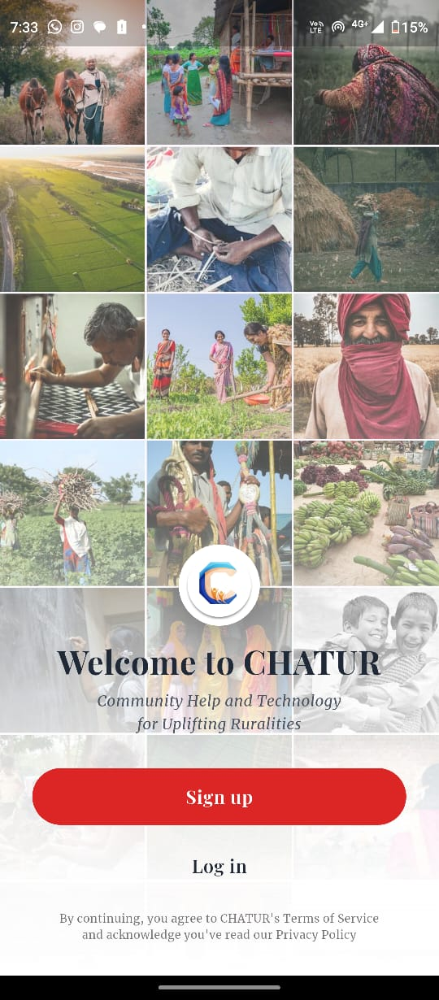
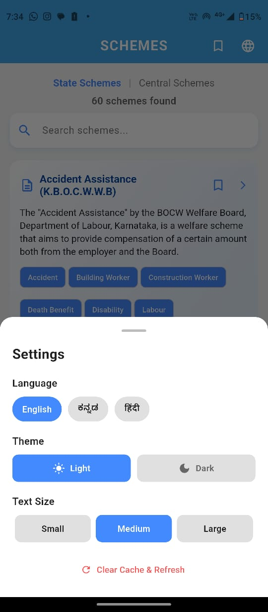
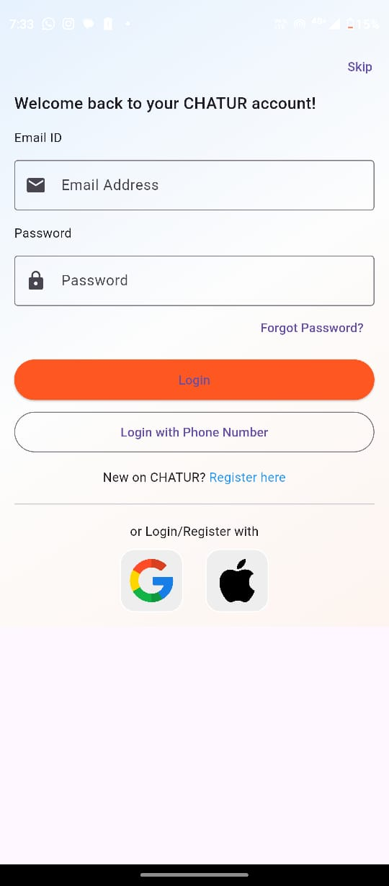
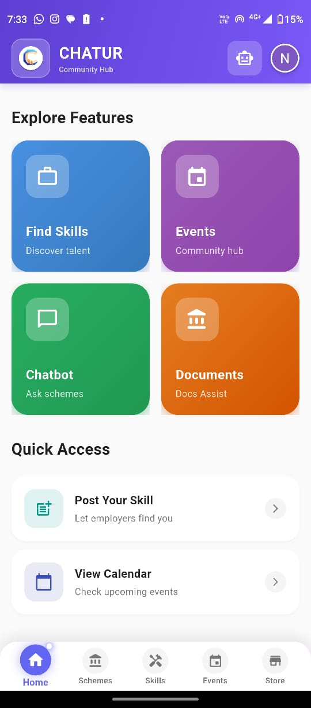
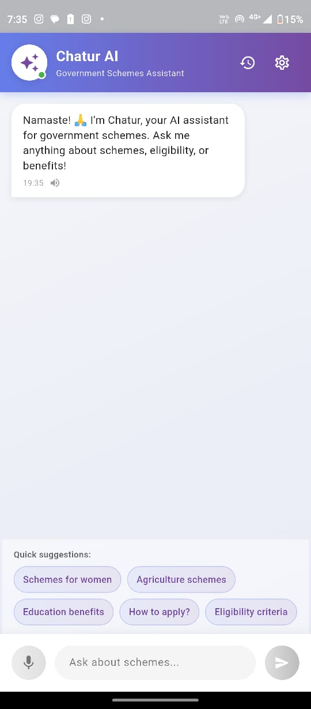

# 🚀 CHATUR-Community Help And Technology for Uplifting Ruralities

<div align="center">


**A comprehensive Flutter-based digital platform connecting citizens with government schemes, local services, events, and marketplace**

[Features](#-features) • [Installation](#-installation) • [Usage](#-usage) • [Project Structure](#-project-structure) • [Contributing](#-contributing)

</div>

---

## 📱 About CHATUR

CHATUR is a multi-featured mobile application designed to bridge the gap between citizens and essential services. The app provides a unified platform for accessing government schemes, finding local service providers, discovering events, shopping from local stores, and utilizing AI-powered document assistance.

### Key Highlights

- 🏠 **Home Dashboard** - Personalized feed with recommended schemes and quick access to all features
- 🏛️ **Government Schemes** - Comprehensive database of State and Central government schemes with eligibility checker
- 🔧 **Skills Marketplace** - Connect with local service providers (Carpenters, Electricians, Plumbers, Cooks, etc.)
- 📅 **Events** - Discover and participate in local events and panchayat activities
- 🛒 **Local Store** - Browse and shop from local vendors and businesses
- 📄 **AI Document Assistant** - Smart form filling using OCR and AI
- 🤖 **AI Chatbot** - Multilingual chatbot for scheme information and assistance
- 👤 **User Profiles** - Separate profiles for citizens and government employees

---

## ✨ Features

### 🏛️ Government Schemes Module
- **State Schemes** - Browse Karnataka state government schemes
- **Central Schemes** - Access central government schemes by ministry
- **Eligibility Checker** - AI-powered eligibility assessment
- **Multilingual Support** - English, Kannada, and Hindi
- **Application Guidance** - Step-by-step application process

### 🔧 Skills Marketplace
- **Service Categories**: Carpenter, Electrician, Plumber, Cook, Painter, Driver, Mechanic, Tutor, Gardener, Cleaner, Tailor
- **Service Provider Profiles** - Detailed profiles with ratings and reviews
- **Location-Based Search** - Find services near you
- **Booking System** - Direct contact and booking
- **QR Code Integration** - Quick service rating via QR codes

### 📅 Events Module
- **Event Discovery** - Browse local events and panchayat activities
- **Event Categories** - Filter by type and location
- **Bookmarking** - Save favorite events
- **Notifications** - Stay updated with event reminders
- **Panchayat Integration** - Special access for panchayat members

### 🛒 Local Store
- **Store Listings** - Browse local stores and vendors
- **Product Catalog** - View products with images and details
- **Shopping Cart** - Add items to cart
- **Store Profiles** - Detailed store information with contact details
- **Categories** - Fresh Vegetables, Pickles, Dairy, Grains, Seeds, Furniture, Clothing, and more

### 📄 AI Document Assistant
- **OCR Technology** - Extract text from form images
- **AI Form Analysis** - Intelligent field detection using Gemini AI
- **Multilingual Support** - English, Kannada, Hindi
- **Smart Question Generation** - AI-generated questions based on form fields
- **Filled Form Generation** - Download completed forms

### 🤖 AI Chatbot
- **Gemini AI Integration** - Powered by Google Gemini
- **Multilingual Chat** - English, Kannada, Hindi
- **Voice Input/Output** - Speech-to-text and text-to-speech
- **Chat History** - Persistent conversation history
- **Scheme Information** - Get details about government schemes

### 🔐 Authentication
- **Phone Authentication** - OTP-based phone verification
- **Email Authentication** - Email/password login
- **Google Sign-In** - Quick authentication with Google
- **User Types** - Separate registration for Citizens and Government Employees

---

## 🛠️ Installation

### Prerequisites

- Flutter SDK (3.7.2 or higher)
- Dart SDK (3.7.2 or higher)
- Android Studio / VS Code
- Firebase account
- Google Cloud account (for Gemini AI)

### Setup Steps

1. **Clone the repository**
   ```bash
   git clone https://github.com/Sanketh360/CHATUR.git
   cd CHATUR
   ```

2. **Install dependencies**
   ```bash
   flutter pub get
   ```

3. **Firebase Configuration**
   - Create a Firebase project at [Firebase Console](https://console.firebase.google.com/)
   - Download `google-services.json` and place it in `android/app/`
   - Configure Firebase for iOS if needed
   - Enable Authentication (Phone, Email, Google)
   - Set up Firestore database
   - Configure Firebase Storage

4. **Configure API Keys**
   - Add your Gemini AI API key in the chatbot configuration
   - Update Cloudinary credentials for image uploads (if used)

5. **Run the app**
   ```bash
   flutter run
   ```

### Build for Production

**Android APK:**
```bash
flutter build apk --release --split-per-abi
```

**Android App Bundle:**
```bash
flutter build appbundle --release
```

---

## 📁 Project Structure

```
lib/
├── Authentication/          # Authentication modules
│   ├── E_login_page.dart   # Employee login
│   ├── E_register_page.dart
│   ├── P_login_page.dart   # Public/Citizen login
│   ├── P_register_page.dart
│   ├── P_OTP_verify.dart   # Phone OTP verification
│   ├── Wrapper.dart        # Auth wrapper
│   └── g_auth_service.dart # Google authentication
│
├── Screens/                 # Main screens
│   ├── main_screen.dart    # Bottom navigation
│   ├── home_screen.dart    # Home dashboard
│   ├── profile_screen.dart # User profile
│   └── OnboardingScreen.dart
│
├── Schemes/                 # Government schemes
│   ├── state/              # State schemes
│   └── Central/            # Central schemes
│
├── Skills/                  # Skills marketplace
│   ├── skills_screen.dart
│   ├── Post_skill.dart
│   ├── MySkills.dart
│   └── skill_detail_screen.dart
│
├── Events/                  # Events module
│   ├── screens/
│   └── services/
│
├── My_Store/                # Local store
│   ├── MainStorePage.dart
│   ├── My_Cart.dart
│   ├── MyStore.dart
│   └── StoreDetailView.dart
│
├── Documents/                # AI document assistant
│   ├── document.dart
│   ├── documentQuestion.dart
│   └── filledForm.dart
│
├── Chatbot/                 # AI chatbot
│   └── chatbot.dart
│
├── Other/                   # Utilities
│   ├── profile_icon.dart
│   └── support.dart
│
└── main.dart                # App entry point
```

---

## 🎯 Usage

### For Users

1. **Registration/Login**
   - Choose between Citizen or Government Employee registration
   - Use phone OTP, email, or Google Sign-In

2. **Browse Schemes**
   - Navigate to Schemes tab
   - Filter by State or Central
   - Check eligibility using AI checker
   - Get application guidance

3. **Find Services**
   - Go to Skills tab
   - Browse by category or search
   - View service provider profiles
   - Contact directly or book services

4. **Discover Events**
   - Check Events tab for local activities
   - Bookmark interesting events
   - Get notifications

5. **Shop Local**
   - Browse stores in Store tab
   - Add products to cart
   - Contact store owners

6. **AI Assistance**
   - Use chatbot for scheme queries
   - Use document assistant for form filling

### For Developers

See [CONTRIBUTING.md](CONTRIBUTING.md) for development guidelines.

---

## 🔧 Technologies Used

- **Framework**: Flutter 3.29.3
- **Language**: Dart 3.7.2
- **Backend**: Firebase (Auth, Firestore, Storage, Analytics)
- **AI Services**: 
  - Google Gemini AI (Chatbot, Document Analysis)
  - Google ML Kit (Text Recognition)
- **Maps**: OpenStreetMap (via flutter_map)
- **Image Storage**: Cloudinary
- **State Management**: Provider/GetX
- **Other Key Packages**:
  - `cached_network_image` - Image caching
  - `geolocator` - Location services
  - `speech_to_text` - Voice input
  - `flutter_tts` - Text-to-speech
  - `mobile_scanner` - QR code scanning
  - `table_calendar` - Calendar widget

---

   ## 📱 Screenshots
     
   <div align="center">
     
    |  | 
   :---:|:---:|:---:
   Onboarding | Schemes | Multilingual
   
     
    |  | 
   :---:|:---:|:---:
   Login | Explore | AI Chatbot
     
   </div>

---

## 🤝 Contributing

Contributions are welcome! Please read [CONTRIBUTING.md](CONTRIBUTING.md) for details on our code of conduct and the process for submitting pull requests.

### Development Setup

1. Fork the repository
2. Create a feature branch (`git checkout -b feature/AmazingFeature`)
3. Commit your changes (`git commit -m 'Add some AmazingFeature'`)
4. Push to the branch (`git push origin feature/AmazingFeature`)
5. Open a Pull Request

---

## 📝 License

This project is licensed under the MIT License - see the [LICENSE](LICENSE) file for details.

---

## 👥 Authors

- **Navaneeth Arya** - *Initial work* - [NavaneethArya](https://github.com/Sanketh360)

---

## 🙏 Acknowledgments

- Flutter team for the amazing framework
- Firebase for backend services
- Google for Gemini AI
- All open-source contributors whose packages made this possible

---

## 📞 Support

For support, email navaneetharyarao@gmail.com or open an issue in the repository.

---

## 🗺️ Roadmap

- [ ] Payment gateway integration
- [ ] Push notifications
- [ ] Offline mode support
- [ ] Advanced analytics
- [ ] Multi-language expansion
- [ ] Admin dashboard
- [ ] API documentation

---

<div align="center">

Made with 💪 dedication, ❤️ passion, and countless hours of hard work using Flutter.

⭐ Star this repo if you find it helpful!

</div>
